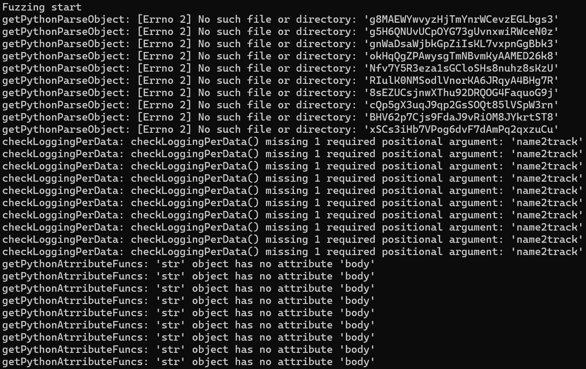
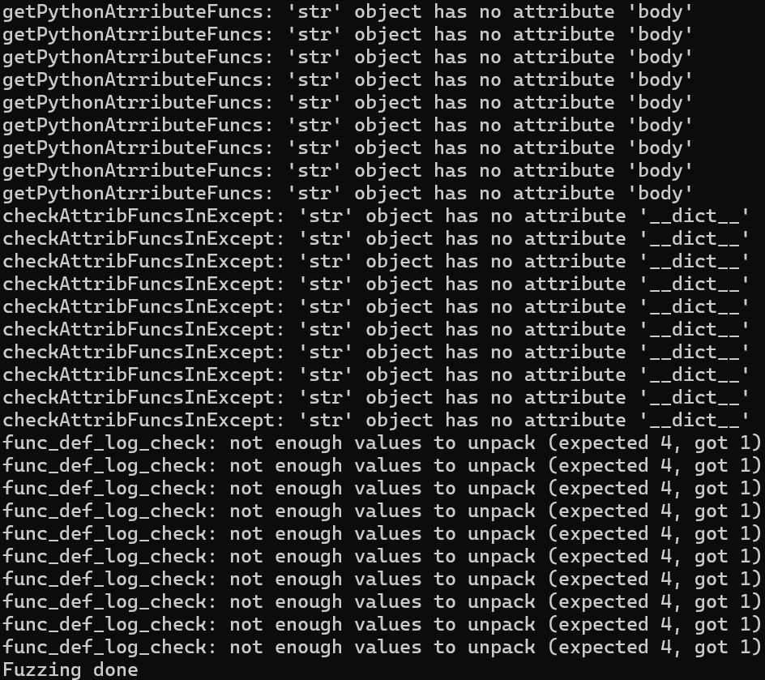
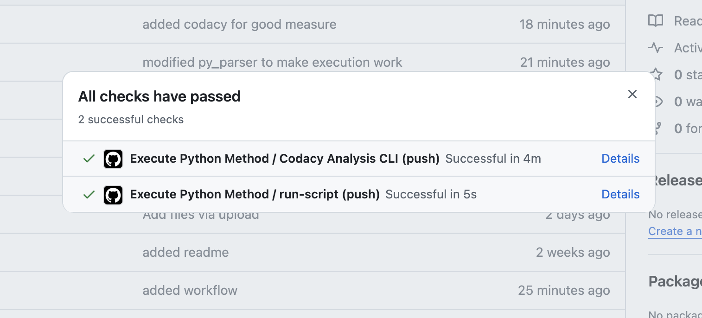
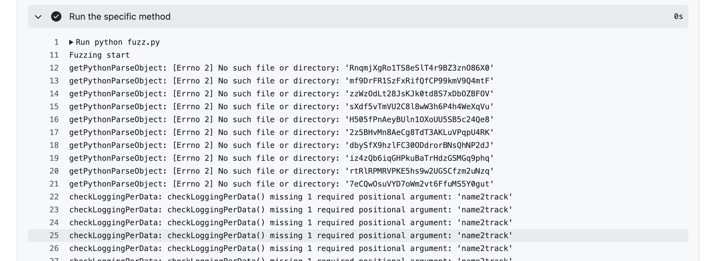
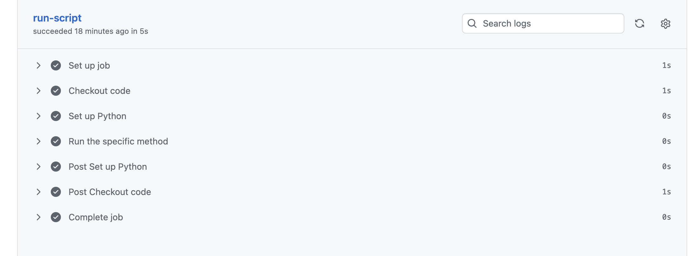
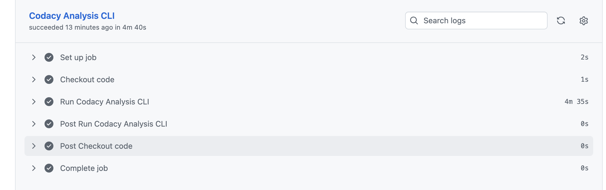

# Deliverables
## (1) Repository with correct name ✅
## (2) Full Completion of all activities as recorded in GitHub repository
- All tasks were fully completed, see repository and other deliverables for more information.
## (3) Report describing what activities your performed and what you have learned
### Continuous Integration
We added a GitHub workflow that runs a Codacy CLI analysis job and that executes the 
fuzz.py file upon every push to the main branch. We learned that integrating CI/CD is 
fairly simple and performant as long as no long-running tasks have to be executed (docker pulls,
or compilations). Even then, the automation saves time and improves quality in the long run
by taking human error in testing consitency out of the equation.

### Forensics
We added logging to the methods `getModelFeatureCount`, `getModelLabelCountb` 
in `FAMELML/lint_engine.py`. We did the same for the functions `getCSVData`, 
`getAllPythonFilesinRepo`, `runFameML` in `FAMLEML/main.py`.

Primary learning outcomes of this task and the related lectures were the value of the use
of specific logging levels (INFO, DEBUG, ...), as well as what to log in order to be able 
to retrace what has happened in the program, i.e. taking a more structured approach than just
logging what we think is valuable.

### Fuzzing
We added the `fuzz.py` file, added a random string generator and caused the fuzzing of 
the methods `getPythonParseObject`, `checkLoggingPerData`, `getPythonAtrributeFuncs`,
`checkAttribFuncsInExcept`, `func_def_log_check` in `py_parser.py`.

We learned that it is important to test different inputs, not just random strings, but also
different object (i.e. files, if the method expects a file) in order to not just catch the same
bug over and over again. The value of fuzzing was new and interesting, compared to the traditional 
testing methods that we already knew.
## (4) Code, logs, and screenshots that show execution of forensics, fuzzing, and continuous integration
### Forensics
See files and methods mentioned in (3)

### Fuzzing
Code is located in `fuzz.py`, see below for screenshots

### Continuous Integration

# (5) In the case of continuous integration (CI), provide the location of the build.
The most recent CI build can be found [here](https://github.com/njoye/GROUP6-FALL2025-SQA/actions).
While there might be newer ones that were created after the last commit to this document,
the most recent one at the time of writing is the run that integrated Codacy, which can be found
[here](https://github.com/njoye/GROUP6-FALL2025-SQA/actions/runs/19773735435)
